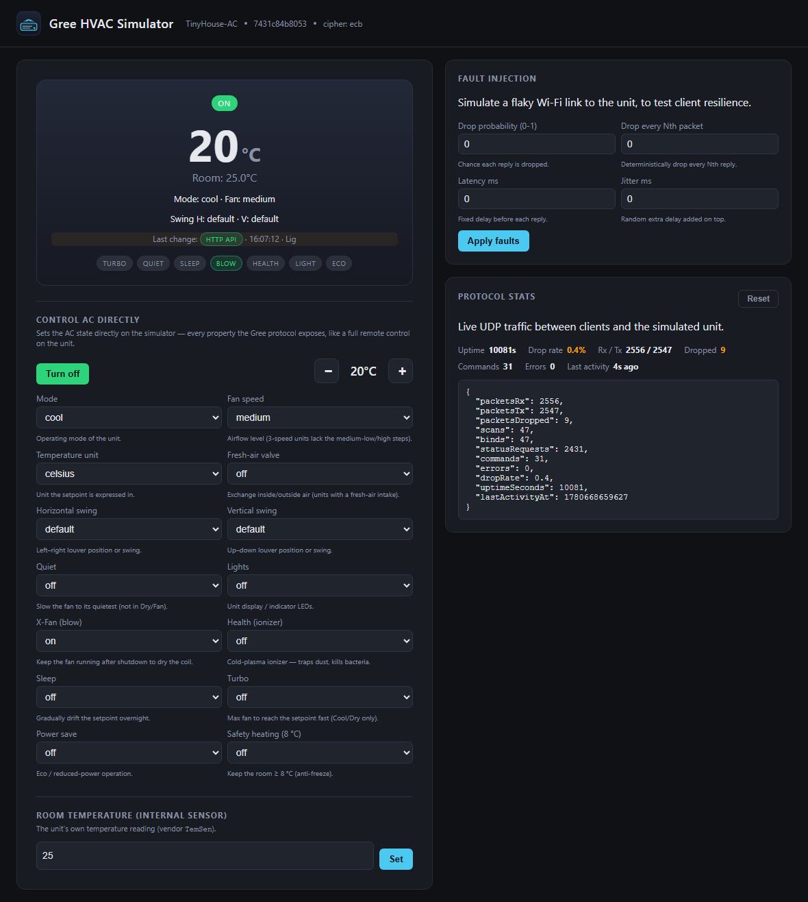

<p align="center">
  
</p>

<h1 align="center">node-red-contrib-gree-hvac</h1>

<p align="center">
  Node-RED nodes to control Gree air-conditioners over their UDP/AES protocol —
  with a full software simulator so you can build and test without the hardware.
</p>

<p align="center">
  <a href="https://www.npmjs.com/package/node-red-contrib-gree-hvac"></a>
  
  <a href="https://github.com/apachler/node-red-contrib-gree-hvac/actions/workflows/ci.yml"></a>
  <a href="https://github.com/apachler/node-red-contrib-gree-hvac/actions/workflows/codeql.yml"></a>
  <a href="https://github.com/apachler/node-red-contrib-gree-hvac/actions/workflows/release.yml"></a>
  <a href="LICENSE"></a>
</p>

Provides a node for control Gree HVAC (Heating, ventilation, and air conditioning).

Designed for unattended 24/7 operation: the node owns the client lifecycle, drives reconnect with exponential backoff, and has two watchdogs (silence-while-connected and stuck-in-connecting) so a wedged Gree WiFi module recovers without a physical power cycle. See [CHANGELOG.md](CHANGELOG.md) for the full list of reliability features.

Nodes
-----

- `gree-hvac` — control and observe a single HVAC unit. Three outputs:
  1. **Changes** — `updated` (delta from the device) or `acknowledged` (delta from a write).
  2. **Snapshot** — full current property map.
  3. **Diagnostics** — structured events (`state`, `error`, `queue_overflow`, `heartbeat`, `update`, `write_ack`) with metrics for alerting and dashboards.
- `gree-hvac-discover` — broadcast-scans the subnet and returns the list of responding devices for populating config nodes.
- `gree-hvac-config` — host + UDP port of a single device.

The node also publishes a live metrics snapshot under `context().get('gree')` (state, uptime, last contact, queue size, reset counters).

Install
-------

### From npm (recommended)

Run the following command in your Node-RED user directory — typically `~/.node-red`:

```
npm install node-red-contrib-gree-hvac
```

### From a GitHub Release tarball

Each GitHub Release ships a packaged `.tgz` you can install directly without going through npm. This is useful for air-gapped Node-RED instances or for pinning to a specific commit before it appears in the npm registry.

```
cd ~/.node-red
npm install https://github.com/apachler/node-red-contrib-gree-hvac/releases/download/v<version>/node-red-contrib-gree-hvac-<version>.tgz
```

Or download the `.tgz` from the [Releases page](https://github.com/apachler/node-red-contrib-gree-hvac/releases) and run `npm install ./node-red-contrib-gree-hvac-<version>.tgz` from your `~/.node-red` directory. Restart Node-RED after installation.

Usage
-----

Import this flow for a ready-made control dashboard (power, mode, temperature, fan, swing, and the feature toggles). For what each property and value means, see the [**Gree protocol & property reference**](docs/PROTOCOL.md).

```json
[{"id":"ff9fe48d.da79d8","type":"debug","z":"fcc6883.6f01278","name":"","active":true,"tosidebar":true,"console":false,"tostatus":false,"complete":"true","targetType":"full","x":550,"y":700,"wires":[]},{"id":"3cfb9d5c.2adfc2","type":"gree-hvac","z":"fcc6883.6f01278","name":"AC","device":"","interval":"1","x":280,"y":640,"wires":[["ff9fe48d.da79d8"],["417b67b1.9d77d8","ff9fe48d.da79d8"]]},{"id":"fab8d073.bed76","type":"switch","z":"fcc6883.6f01278","name":"","property":"topic","propertyType":"msg","rules":[{"t":"eq","v":"power","vt":"str"},{"t":"eq","v":"mode","vt":"str"},{"t":"eq","v":"temperature","vt":"str"},{"t":"eq","v":"fanSpeed","vt":"str"},{"t":"eq","v":"swingVert","vt":"str"},{"t":"eq","v":"swingHor","vt":"str"},{"t":"eq","v":"health","vt":"str"},{"t":"eq","v":"blow","vt":"str"},{"t":"eq","v":"lights","vt":"str"},{"t":"eq","v":"powerSave","vt":"str"}],"checkall":"true","repair":false,"outputs":10,"x":430,"y":460,"wires":[["f36ddc6a.6a76d"],["ed7a4d0b.d3c85"],["7f2711eb.f70ff"],["b0f5ed20.f0dc4"],["bb2fd30d.6faed"],["426d8937.d2e9a8"],["58310de9.08b1c4"],["5be9ffdd.e9e11"],["429db373.92628c"],["29e1bfb7.c963c"]]},{"id":"f36ddc6a.6a76d","type":"ui_switch","z":"fcc6883.6f01278","name":"","label":"Power","tooltip":"","group":"5c569ec8.d608f","order":1,"width":"0","height":"0","passthru":false,"decouple":"true","topic":"power","style":"","onvalue":"on","onvalueType":"str","onicon":"","oncolor":"","offvalue":"off","offvalueType":"str","officon":"","offcolor":"","x":610,"y":80,"wires":[["62c89d4e.1db264"]]},{"id":"429db373.92628c","type":"ui_switch","z":"fcc6883.6f01278","name":"","label":"Lights","tooltip":"","group":"5c569ec8.d608f","order":9,"width":"3","height":"1","passthru":false,"decouple":"true","topic":"lights","style":"","onvalue":"on","onvalueType":"str","onicon":"","oncolor":"","offvalue":"off","offvalueType":"str","officon":"","offcolor":"","x":610,"y":560,"wires":[["62c89d4e.1db264"]]},{"id":"7f2711eb.f70ff","type":"ui_numeric","z":"fcc6883.6f01278","name":"","label":"Temperature","tooltip":"","group":"5c569ec8.d608f","order":2,"width":0,"height":0,"passthru":false,"topic":"temperature","format":"{{value}}","min":"23","max":"25","step":1,"x":630,"y":200,"wires":[["62c89d4e.1db264"]]},{"id":"bb2fd30d.6faed","type":"ui_dropdown","z":"fcc6883.6f01278","name":"","label":"Vertical swing ","tooltip":"","place":"Select option","group":"5c569ec8.d608f","order":6,"width":0,"height":0,"passthru":false,"options":[{"label":"Default","value":"default","type":"str"},{"label":"Swing in full range","value":"full","type":"str"},{"label":"Fixed top","value":"fixedTop","type":"str"},{"label":"Fixed mid-top","value":"fixedMidTop","type":"str"},{"label":"Fixed mid","value":"fixedMid","type":"str"},{"label":"Fixed mid-bottom","value":"fixedMidBottom","type":"str"},{"label":"Fixed bottom","value":"fixedBottom","type":"str"},{"label":"Swing bottom","value":"swingBottom","type":"str"},{"label":"Swing mid-bottom","value":"swingMidBottom","type":"str"},{"label":"Swing mid","value":"swingMid","type":"str"},{"label":"Swing mid top","value":"swingMidTop","type":"str"},{"label":"Swing top","value":"swingTop","type":"str"}],"payload":"","topic":"swingVert","x":640,"y":320,"wires":[["62c89d4e.1db264"]]},{"id":"62c89d4e.1db264","type":"rbe","z":"fcc6883.6f01278","name":"","func":"rbe","gap":"","start":"","inout":"out","property":"payload","x":830,"y":700,"wires":[["3cfb9d5c.2adfc2","ff9fe48d.da79d8"]]},{"id":"426d8937.d2e9a8","type":"ui_dropdown","z":"fcc6883.6f01278","name":"","label":"Horizontal swing ","tooltip":"","place":"Select option","group":"5c569ec8.d608f","order":5,"width":0,"height":0,"passthru":false,"options":[{"label":"Default","value":"default","type":"str"},{"label":"Full","value":"full","type":"str"},{"label":"Fixed left","value":"fixedLeft","type":"str"},{"label":"Fixed mid-left","value":"fixedMidLeft","type":"str"},{"label":"Fixed mid","value":"fixedMid","type":"str"},{"label":"Fixed mid-right","value":"fixedMidRight","type":"str"},{"label":"Fixed right","value":"fixedRight","type":"str"},{"label":"Full alt","value":"fullAlt","type":"str"}],"payload":"","topic":"swingHor","x":640,"y":380,"wires":[["62c89d4e.1db264"]],"info":"Controls the swing mode of the horizontal air blades (not available on all units)"},{"id":"b0f5ed20.f0dc4","type":"ui_dropdown","z":"fcc6883.6f01278","name":"","label":"Fan speed","tooltip":"","place":"Select option","group":"5c569ec8.d608f","order":4,"width":0,"height":0,"passthru":false,"options":[{"label":"Auto","value":"auto","type":"str"},{"label":"Low","value":"low","type":"str"},{"label":"Medium low","value":"mediumLow","type":"str"},{"label":"Medium","value":"medium","type":"str"},{"label":"Medium high","value":"mediumHigh","type":"str"},{"label":"High","value":"high","type":"str"}],"payload":"","topic":"fanSpeed","x":630,"y":260,"wires":[["62c89d4e.1db264"]]},{"id":"29e1bfb7.c963c","type":"ui_switch","z":"fcc6883.6f01278","name":"","label":"Power save","tooltip":"","group":"5c569ec8.d608f","order":10,"width":"3","height":"1","passthru":false,"decouple":"true","topic":"powerSave","style":"","onvalue":"on","onvalueType":"str","onicon":"","oncolor":"","offvalue":"off","offvalueType":"str","officon":"","offcolor":"","x":630,"y":620,"wires":[["62c89d4e.1db264"]]},{"id":"417b67b1.9d77d8","type":"split","z":"fcc6883.6f01278","name":"","splt":"\\n","spltType":"str","arraySplt":1,"arraySpltType":"len","stream":false,"addname":"topic","x":290,"y":460,"wires":[["fab8d073.bed76"]]},{"id":"ed7a4d0b.d3c85","type":"ui_dropdown","z":"fcc6883.6f01278","name":"","label":"Mode","tooltip":"","place":"Select option","group":"5c569ec8.d608f","order":3,"width":"0","height":"0","passthru":false,"options":[{"label":"Auto","value":"auto","type":"str"},{"label":"Cool","value":"cool","type":"str"},{"label":"Dry","value":"dry","type":"str"},{"label":"Fan only","value":"fan_only","type":"str"},{"label":"Heat","value":"heat","type":"str"}],"payload":"","topic":"mode","x":610,"y":140,"wires":[["62c89d4e.1db264"]]},{"id":"58310de9.08b1c4","type":"ui_switch","z":"fcc6883.6f01278","name":"","label":"Cold plasma","tooltip":"","group":"5c569ec8.d608f","order":7,"width":"3","height":"1","passthru":false,"decouple":"true","topic":"health","style":"","onvalue":"on","onvalueType":"str","onicon":"","oncolor":"","offvalue":"off","offvalueType":"str","officon":"","offcolor":"","x":630,"y":440,"wires":[["62c89d4e.1db264"]]},{"id":"5be9ffdd.e9e11","type":"ui_switch","z":"fcc6883.6f01278","name":"","label":"X-Fan","tooltip":"","group":"5c569ec8.d608f","order":8,"width":"3","height":"1","passthru":false,"decouple":"true","topic":"blow","style":"","onvalue":"on","onvalueType":"str","onicon":"","oncolor":"","offvalue":"off","offvalueType":"str","officon":"","offcolor":"","x":610,"y":500,"wires":[["62c89d4e.1db264"]]},{"id":"5c569ec8.d608f","type":"ui_group","z":"","name":"AC","tab":"168c092a.469d97","disp":true,"width":"6","collapse":false},{"id":"168c092a.469d97","type":"ui_tab","z":"","name":"Home","icon":"dashboard","disabled":false,"hidden":false}]
```

Protocol
--------

The Gree UDP/AES wire protocol and every device property (vendor code, values, and what each feature actually does — `air`, `blow`/X-Fan, `health`, `sleep`, `quiet`, `turbo`, `powerSave`, `safetyHeating`, …) are documented in [**docs/PROTOCOL.md**](docs/PROTOCOL.md). The simulator implements it byte-for-byte, so it doubles as an executable spec.

Development setup
-----------------

After cloning, run `npm install` once — the `prepare` script wires up `core.hooksPath` to `./.githooks/` so the pre-push hook runs `eslint --fix` against the whole repo before every push. Pushes are refused if eslint reports errors it couldn't auto-fix, or if `--fix` produced changes that haven't been staged + committed (so the fix lands in a reviewable commit, not silently on the remote).

Skip the hook for an emergency push with `GREE_SKIP_LINT=1 git push ...`. CI sets `CI=true` so the hook is a no-op in workflows (CI runs `npm run lint` itself anyway).

Example flow for real hardware
------------------------------

[`docker/nodered/flows.user.json`](docker/nodered/flows.user.json) is the **production** flow — the one to import into a real Node-RED (e.g. on a Victron Venus OS) controlling real Gree hardware. It contains only the control logic and dashboards; it has no simulator dependencies. After importing, point the `gree-hvac-config` node at your AC's host/IP and wire your real Victron/Ruuvi input nodes into the `Collect Data` function (named `Battery SOC`, `Battery State`, `Battery Voltage`, `Ruuvi Inside`, `Ruuvi Outside`).

The simulator-only `flows.mocks.json` (the Sim Sensors / Sim Clock pages and mock sensor feed) is merged in **only** for the docker stack and must not be deployed to hardware.

Development with the simulator
------------------------------

The repo ships a software simulator of a Gree HVAC device, so you can develop and test the nodes without owning hardware. The simulator implements the same UDP protocol (AES-ECB / AES-GCM) the real device speaks, exposes a small HTTP dashboard that visualizes the AC state in real time, and serves mock Victron / Ruuvi sensor values so the bundled example flow runs end-to-end.

<p align="center">
  
</p>

The dashboard shows live AC state and the **source** of each change ("Gree UDP protocol" when a client sets a value over the wire, "HTTP API" for a direct dashboard/REST action), plus controls to drive the AC directly, inject faults (packet drop / latency), and set the mock sensor values the example flow consumes.

> The demo GIF and this screenshot are generated, not hand-placed — see [`docs/`](docs/) (`vhs docs/demo.tape` and `node docs/screenshot.mjs`).

### Requirements

- Docker + Docker Compose v2 (`docker compose` subcommand)
- Node.js 18+ on the host (only for running the e2e tests; the containers ship their own Node)

### Bring up the stack

```bash
npm run sim:up      # docker compose up -d --build
```

This starts two services:

| Service        | URL                                | What it is                                            |
| -------------- | ---------------------------------- | ----------------------------------------------------- |
| `gree-sim`     | http://localhost:8080              | Simulator dashboard (live AC state, fault injection, mock sensor knobs) |
| `gree-sim`     | udp://localhost:7000               | Gree protocol endpoint (also reachable in-cluster as `gree.lan`) |
| `node-red`     | http://localhost:1880              | Node-RED with the contrib nodes + the example flow pre-loaded |

The sim container is aliased as `gree.lan` on the docker network, so the example flow's `gree-hvac-config` (which targets `gree.lan`) works without modification.

Tail logs and tear down:

```bash
npm run sim:logs
npm run sim:down    # also removes the network and the Node-RED userdir volume
```

### Hot-reload while iterating on the nodes

`npm run sim:dev` brings the stack up with the host's `gree-hvac/` source bind-mounted over the image's installed copy and Node-RED wrapped in `nodemon`, so edits to `gree-hvac/*.js` or `gree-hvac/*.html` trigger a runtime restart within ~2 seconds:

```bash
npm run sim:dev          # foreground; Ctrl+C to stop
npm run sim:dev:down     # tear down the dev stack
```

What's mounted: `./gree-hvac/` → `/data/node_modules/node-red-contrib-gree-hvac/gree-hvac/` (read-only) and `./package.json` → the same package's package.json. Flow edits made through the editor still persist into Node-RED's internal `/data` volume.

Node-RED does not hot-reload nodes in place — `nodemon` restarts the whole runtime on change, so the editor will briefly lose its WebSocket and reconnect. The browser tab survives the restart; just re-deploy if you were mid-edit. Use `npm run sim:up` (the production-like mode) when you want stable behavior for the e2e suite or for letting flows run unattended.

### Editing the flow without rebuilding

The flow source lives in two files — [`docker/nodered/flows.user.json`](docker/nodered/flows.user.json) (production) and `flows.mocks.json` (sim-only mocks tab) — that are concatenated by `merge-flows.js` and baked into the image at **build time**. Three scripts move between those source files and the running editor so you don't have to rebuild for every flow tweak:

| Command | Direction | What it does |
| ------- | --------- | ------------ |
| `npm run flow:push` | sources → running editor | Merges both source files and full-deploys them to the running Node-RED over its admin API. Loads instantly and persists to `/data` — **no rebuild**. |
| `npm run flow:pull` | running editor → sources | Captures the deployed flow and splits it back into the two source files (mock nodes detected by tab membership; shared dashboard config stays with the production flow so the files never collide). Order-preserving, so a small edit is a small diff. |
| `merge-flows.js` | sources → image | Build step only; runs in the Dockerfile. |

```bash
# Editing the source files on the host:
#   edit flows.user.json / flows.mocks.json, then:
npm run flow:push        # …and refresh the editor in the browser

# Editing in the browser editor, then saving it back to the repo:
#   edit + Deploy at http://localhost:1880, then:
npm run flow:pull        # writes both source files — review with `git diff`
```

Both default to the full flow and target `http://127.0.0.1:1880` (override with `NR_URL`); each takes an optional target arg (`flow:push:user`, `flow:pull:user`, `flow:pull:mocks`). `flow:push` overwrites whatever is deployed, so refresh the editor afterward (and expect the usual "flows changed" warning if you had unsaved edits open). You still need a rebuild (`npm run sim:dev`) when the contrib node code or the image itself changes — but not for flow edits.

### Run the tests

**Unit tests of the simulator itself** (no docker required):

```bash
npm run test:sim
```

**End-to-end tests** against the live compose stack — boots the stack, exercises the simulator over UDP using the real `gree-hvac-client`, drives the deployed Node-RED flow via its admin API, injects packet drops to verify the connection-manager's recovery, and tears the stack down:

```bash
npm run test:e2e
```

Useful env vars while iterating:

- `E2E_SKIP_BUILD=1` — reuse the existing images (skip `docker compose build`)
- `E2E_KEEP_UP=1` — leave the stack running after the tests finish so you can poke at it

### What's actually being tested

| Test file                                  | What it covers                                                                                                   |
| ------------------------------------------ | ---------------------------------------------------------------------------------------------------------------- |
| `sim/test/simulator.test.js`               | Wire-level: discovery, bind, status, cmd, fault injection — without involving the contrib nodes                  |
| `sim/test/client-roundtrip.test.js`        | Real `gree-hvac-client` connecting to the in-process simulator over loopback                                     |
| `test/e2e/sim.e2e.test.js`                 | Dashboard HTTP API + client round-trip against the dockerized sim                                                |
| `test/e2e/nodered.e2e.test.js`             | Node-RED admin API: flow deployed, `gree-hvac-config` host wired to `gree.lan`, manual switch + button flow drives the sim's AC state |
| `test/e2e/fault-recovery.e2e.test.js`      | Sets `dropEvery: 2` on the sim, verifies the client still surfaces status updates                                |

Contributing
------------

Contributions are welcome! See [CONTRIBUTING.md](CONTRIBUTING.md) for the dev
setup, the pre-push lint hook, the testing commands, and the Conventional-Commit
PR-title convention that drives the release notes. Please also read the
[Code of Conduct](CODE_OF_CONDUCT.md).

Support
-------

For usage questions and how-to help, see [SUPPORT.md](SUPPORT.md). For what each
Gree property and value means, see [docs/PROTOCOL.md](docs/PROTOCOL.md).

Security
--------

Please report security vulnerabilities privately — do **not** open a public
issue. See the [security policy](SECURITY.md).

License
-------

[MIT](LICENSE) © Igor Starovierov and contributors.

Acknowledgements
----------------

- Built on [`gree-hvac-client`](https://www.npmjs.com/package/gree-hvac-client)
  for the UDP/AES wire protocol.
- Originally authored by [Igor Starovierov](https://github.com/inwaar); currently
  maintained by [Andreas Pachler](https://github.com/apachler).
